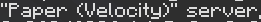
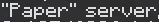

<b>Lightweight plugin for removing Velocity watermark from server's brand</b>

---

**NotAVelocity** is a lightweight plugin for Velocity proxy servers that removes the watermark from server's brand (player's F3 screen).
All versions ranging from 1.7 to 1.20.4 are supported and the plugin is made future-proof to work on future versions as well.

#### Server brand on a Paper server before

#### Server brand on a Paper server after
